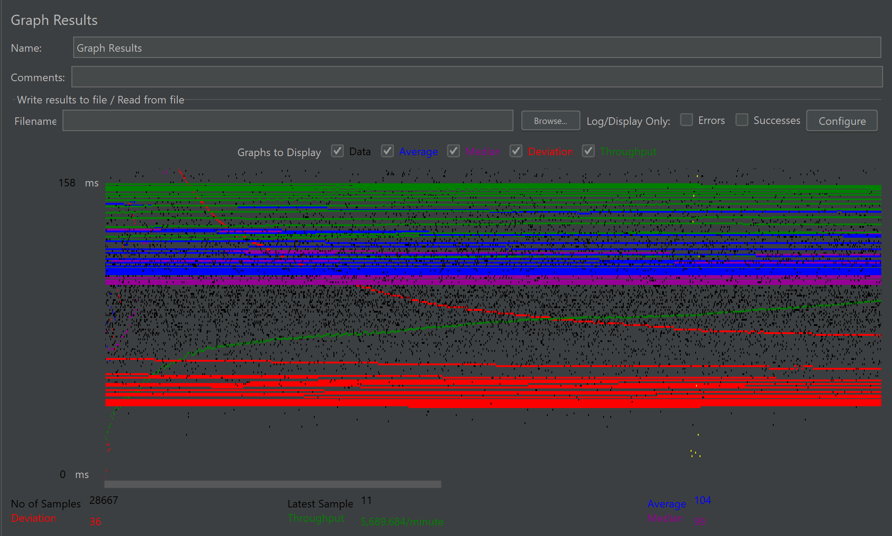
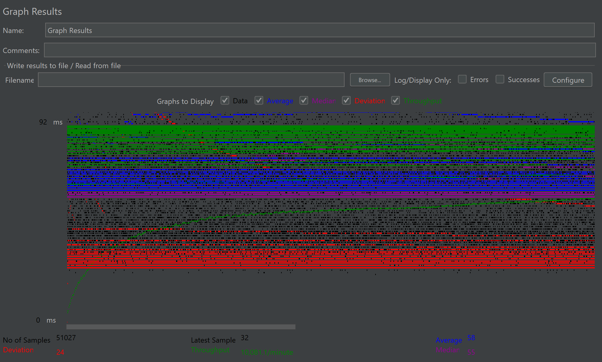

# **CS 122B Project 5**

- # General
    - #### Team#: Proj:Zot
    
    - #### Names: Caitlynn Chang & David Lim
    
    - #### Project 5 Video Demo Link:

    - #### Instruction of deployment:
      1. Clone the repository (git clone https://github.com/uci-jherold2-fall23-cs122b/2023-fall-cs122b-proj-zot.git)
 
      2. Navigate into the repository (cd 2023-fall-cs122b-proj-zot)
      
      3. If moviedb not populated yet, populate the 'moviedb' database by running 'movie-data.sql.'
      
      4. Run the 'alter_movie_table_fulltext.sql' to allow full-text search in the SQL database and 'stored-procedure.sql' to add the stored procedure into the SQL database.
      
      5. If the customer and employee login information is not encrypted yet, move the 'cs122b-project3-excryption-example-main' folder outside of root repository and run the UpdateSecturePassword example to encrypt the customer and employee databases.
      
      6. If using local, run the program on IntelliJ with Tomcat configurations. If using a server, run 'mvn package' in the main repository, copy the war file into the Tomcat, open the Tomcat manager and select FabFlix. 

    - #### Collaborations and Work Distribution:
      Caitlynn Chang:
      - Task 1 (JDBC Connection Pooling)
      - Task 4.1 (Preparing code for time measurement)
      - Task 3 (Code editing part)
      - Collaborated on 4.2 - 4.3 (JMeter)

      David Lim:
      - Task 2 (MYSQL Master-Slave Replication)
      - Task 3 (Server part)
      - Collaborated on Task 4.2-4.3 (JMeter)

- # Connection Pooling
    - #### Include the filename/path of all code/configuration files in GitHub of using JDBC Connection Pooling.
        - WebContent/META-INF/context.xml (configuration file)
        - src/Servlets/AddMovieServlet.java
        - src/Servlets/AddStarServlet.java
        - src/Servlets/AutocompleteServlet.java
        - src/Servlets/CreditCardServlet.java
        - src/Servlets/DashboardServlet.java
        - src/Servlets/EmployeeLoginServlet.java
        - src/Servlets/GenreServlet.java
        - src/Servlets/ItemsServlet.java
        - src/Servlets/LoginServlet.java
        - src/Servlets/MovieServlet.java
        - src/Servlets/MovieTitleServlet.java
        - src/Servlets/SearchServlet.java
        - src/Servlets/SingleMovieServlet.java
        - src/Servlets/SingleStarServlet.java
        - src/Servlets/StarsServlet.java (although never actually used)
          
    - #### Explain how Connection Pooling is utilized in the Fabflix code.
    Connection pooling is used to reduce the amount of time it takes to establish a connection whenever a servlet wants to connect to the database. When a servlet gets a connection, it gets a connection from the pool of connections already established in context.xml. When the servlet is done using the connection, close() is called. This call does not close the connection. Instead, the connection is returned to the pool of connections for other servlets to use.
  
    - #### Explain how Connection Pooling works with two backend SQL.
    With the two backend SQL, the database connection is either to the master database or the local/slave database. When a servlet needs to read from the database, it gets a connection from the the connection pool associated with the local/slave database. When a servlet needs to write to the database, it gets a connection from the connection pool associated with the master database.

- # Master/Slave
    - #### Include the filename/path of all code/configuration files in GitHub of routing queries to Master/Slave SQL.
      - WebContent/META-INF/context.xml (configuration file)
      - To Master SQL:
          - src/Servlets/AddMovieServlet.java
          - src/Servlets/AddStarServlet.java
          - src/Servlets/CreditCardServlet.java
          - cs122b-project3-encryption-example-main/src/main/java/UpdateSecurePassword.java
            
      - To Slave or Master SQL:
          - src/Servlets/AutocompleteServlet.java
          - src/Servlets/DashboardServlet.java
          - src/Servlets/EmployeeLoginServlet.java
          - src/Servlets/GenreServlet.java
          - src/Servlets/ItemsServlet.java
          - src/Servlets/LoginServlet.java
          - src/Servlets/MovieServlet.java
          - src/Servlets/MovieTitleServlet.java
          - src/Servlets/SearchServlet.java
          - src/Servlets/SingleMovieServlet.java
          - src/Servlets/SingleStarServlet.java
          - cs122b-project3-encryption-example-main/src/main/java/VerifyPassword.java (although never actually used)
          - src/Servlets/StarsServlet.java (although never actually used)

    - #### How read/write requests were routed to Master/Slave SQL?
      In the context.xml, we defined two resources for the SQL database connections. The original (jdbc/moviedb) routes read request to either the Master or Slave instances. The new resource (jdbc/master) routes write request to only the master class.
    

- # JMeter TS/TJ Time Logs
    - #### Instructions of how to use the `log_processing.*` script to process the JMeter logs.
        - Navigate to the root of the repository (cd 2023-fall-cs122b-proj-zot), run 'python log_processing.py [LOG_FILENAME_WITH_PATH]' on the command line. The TS and TJ averages will print on in the terminal.

- # JMeter TS/TJ Time Measurement Report

| **Single-instance Version Test Plan**          | **Graph Results Screenshot** | **Average Query Time(ms)** | **Average Search Servlet Time(ms)** | **Average JDBC Time(ms)** | **Analysis** |
|------------------------------------------------|------------------------------|----------------------------|-------------------------------------|---------------------------|--------------|
| Case 1: HTTP/1 thread                          |   | 27                         | 10.618427945814194             | 10.23943828920971         | The average search servlet time is really close the the JDBC time, which shows that most of the servlet time is related to JDBC tasks.            |
| Case 2: HTTP/10 threads                        |    | 104                         | 85.45868345411533          | 85.19410142339412         | The increase from one thread to 10 threads increased the average time it takes to query. The throughput also increased, which may correlate with the increase in average query time since more calls are being made to the server. All threads had relatively the same average times.           |
| Case 3: HTTPS/10 threads                       |    | 102                         | 84.24469687639824           | 83.9398164747883                        | HTTPS seems relatively the same as HTTP, but faster by 1-2 seconds in average query time, average search servlet time, and average JDBC time. This is unusual since HTTP is usually faster than HTTPS since a handshake does not need to be established with HTTP. This deviation could be due to AWS inconsistent query times. This can be seen with the increase in throughput per minute      |
| Case 4: HTTP/10 threads/No connection pooling  |    | 104                         | 84.6022457370276                                  | 84.16114960491328                       | This run had the same average query time as case 2, which has connection pooling. This is unusual since no connection pooling should make the query time slower since connections have to open and close. |

| **Scaled Version Test Plan**                   | **Graph Results Screenshot** | **Average Query Time(ms)** | **Average Search Servlet Time(ms)** | **Average JDBC Time(ms)** | **Analysis** |
|------------------------------------------------|------------------------------|----------------------------|-------------------------------------|---------------------------|--------------|
| Case 1: HTTP/1 thread                          |    | ??                         | ??                                  | ??                        | ??           |
| Case 2: HTTP/10 threads                        |    | ??                         | ??                                  | ??                        | ??           |
| Case 3: HTTP/10 threads/No connection pooling  |    | 58    | Master: 53.04652505188679, Slave: 23.012047691328522, Average: 40.23549614303076    | Master: 52.76119158234208, Slave: 22.6770740152107, Average: 39.92898893658976                         | ??           |

# **CS 122B Project 4**

## Demo Video
https://www.youtube.com/watch?v=T3aWGcP8wos

## Contributions

Caitlynn Chang
- Implemented Autocomplete

David Lim
- Implemented Andoid

# **CS 122B Project 3**

## Demo Video
https://youtu.be/VF5bSHseUDs

## Contributions

Caitlynn Chang
- Implemented Dashboard using Stored Procedure
- Implemented PreparedStatements
- Implemented recatpcha
- Implemented HTTPS
- Implemented Encrypted Password

David Lim
- Importing large XML data files into database

## Files with Prepared Statements
- AddMovieServlet.java
- AddStarServlet.java
- CreditCardServlet.java
- EmployeeLoginServlet.java
- ItemsServlet.java
- LoginServlet.java
- SearchServlet.java
- SingleMovieServlet.java
- SingleStarServelet.java

## Parsing time optimization strategies
1. Less to SQL
2. Used a Hashmap while parsing through data to allow constant time getting

## Inconsistent data reports from parsing
In ReferenceInconsistencyReport.txt. Can be seen in video, but named InconsistencyReport.txt.

# **CS 122B Project 2**

## Demo Video
https://www.youtube.com/watch?v=3YMf_IH_Jrw

## Contributions

Caitlynn Chang
- Main Page (search and browse)
- Single Star/Movie Pages + Jump Functionaility
- Movie List Page 

David Lim
- Login Page
- Shopping Cart + Payment Pages and Functions
- Demo Video

## Where Used LIKE/ILIKE
LIKE was mainly used for the Search and Browse Function (Servlets.SearchServlet). For the search feature, LIKE was used for finding the title, director and star with the pattern being %substring%. For the browsing feature, LIKE was used for genres with the format %genre% and movie titles with the format pattern% (except for *). Genre was formatted this way due to query returning genres as a string of all the genres. 
 
# **CS 122B Project 1**

## Demo Video
https://youtu.be/39aJCIOgjM8?si=dw449bWWeoUZefQS

## Contributions

Caitlynn Chang
- Single movie and single star pages
- SQL Create Table
- Edited HTML\CSS files

David Lim
- AWS Setup
- Servlet and JS for main Movie page
- Demo'd Project
